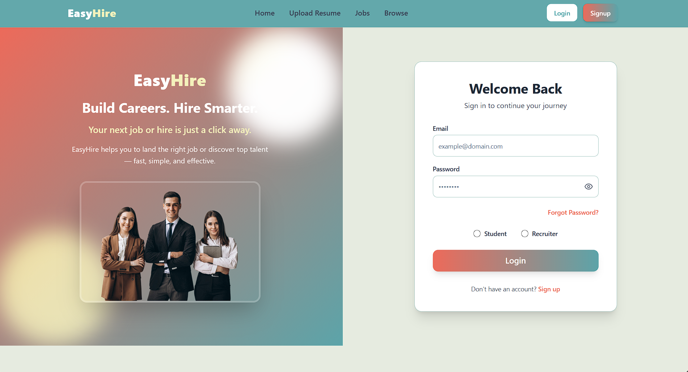
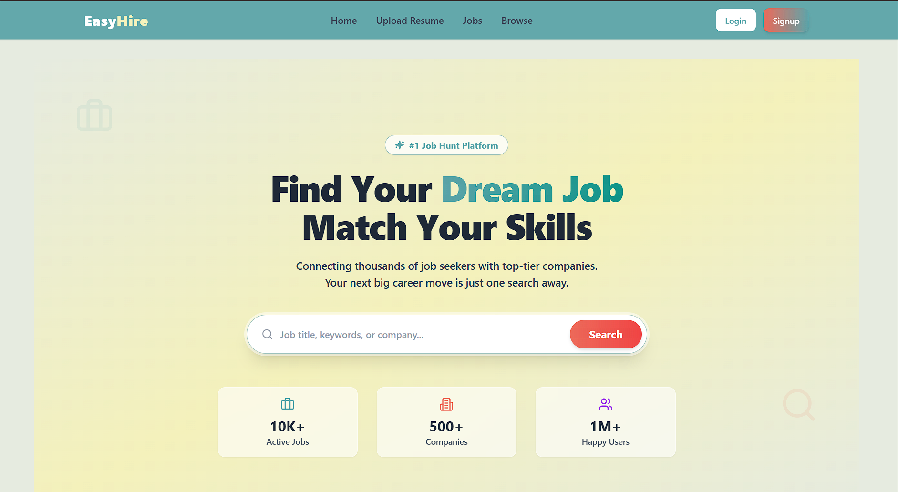
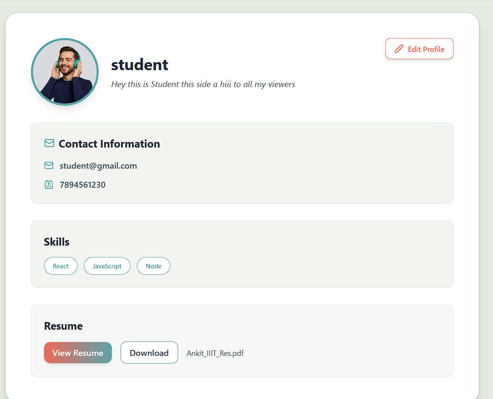
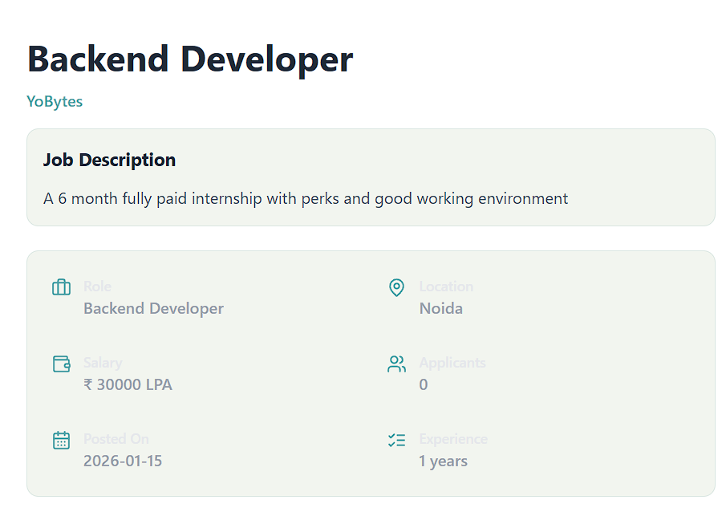

# 💼 EasyHire - AI-Powered Job Portal

**EasyHire** is a comprehensive job portal built with the **MERN stack** (MongoDB, Express.js, React.js, Node.js). It empowers both **job seekers** and **recruiters** with an intuitive platform to interact, post jobs, and receive smart, AI-based job recommendations.

---

## 🚀 Live Demo
🔗 **Live Site:** [https://easy-hire-two.vercel.app](https://easy-hire-two.vercel.app)

---

## 🚀 Features

- 🔐 **Secure Authentication**: JWT-based login/signup for candidates and recruiters, with secure password hashing (Bcrypt).
- 🔄 **Forgot Password**: Secure email-based password reset flow using *Nodemailer*.
- 📋 **Smart Job Listings**: Dynamic job feed with filtering and search capabilities.
- 📤 **Recruiter Dashboard**: Recruiters can register companies, post jobs, and manage candidate applications.
- 🗃 **Application Tracking**: Real-time status updates for applied jobs.
- 🤝 **Real-time Chat**: Integrated messaging system for direct communication between recruiters and candidates (`Socket.io`).
- 🧠 **AI Resume Analysis**: **Python + spaCy** microservice that parses PDF resumes to extract skills and match candidates with the best jobs automatically.
- 🌈 **Modern UI**: Built with **React**, **Tailwind CSS**, and **Shadcn UI** for a responsive and accessible design.
- ☁ **Cloud Storage**: Profile pictures and resume PDFs are securely stored on **Cloudinary**.

---

## 🛠 Tech Stack

| Layer | Technologies |
|---|---|
| **Frontend** | React.js, Vite, Tailwind CSS, Shadcn UI, Redux Toolkit |
| **Backend** | Node.js, Express.js, Socket.io, Nodemailer |
| **Database** | MongoDB Atlas |
| **AI / NLP** | Python (Flask), spaCy, PyMuPDF (PDF parsing) |
| **DevOps** | Render (Backend/AI), Vercel (Frontend) |

---


| Login Page | Home Page |
|:---:|:---:|
|  |  |

| Profile | Job Recommendations |
|:---:|:---:|
|  |  |

### 🏢 Recruiter's Side

| Admin Dashboard | Applicant Review |
|:---:|:---:|
|  |  |

---

## 📁 Project Structure

```bash
easyhire-mern-job-portal/
├── backend/                # Node.js + Express server
│   ├── controllers/        # API logic
│   ├── models/             # Mongoose Schemas
│   ├── python_logic/       # Python scripts for AI Resume Parsing
│   └── routes/             # API Endpoints
├── frontend/               # React + Vite Client
│   ├── src/
│   │   ├── components/     # Reusable UI components
│   │   ├── redux/          # State management
│   │   └── utils/          # Constants & Helper functions
└── README.md
⚡ Getting Started Locally
Clone the repository

Bash

git clone [https://github.com/AnkitSharma5304/EasyHire](https://github.com/AnkitSharma5304/EasyHire.git)
cd easyhire
Setup Backend

Bash

cd backend
npm install
# Create a .env file with MONGO_URI, SECRET_KEY, CLOUD_NAME, etc.
npm start
Setup Frontend

Bash

cd frontend
npm install
npm run dev
Made with ❤️ by [ANKIT SHARMA]